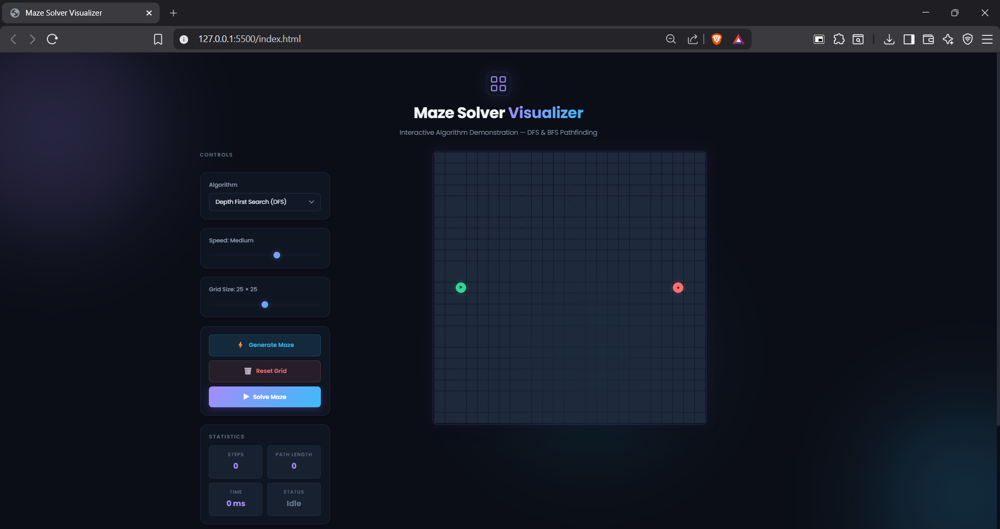

# 🧩 Maze Solver Visualizer

## 📌 Description

This is an interactive web-based **Maze Solver Visualizer** that demonstrates pathfinding algorithms using a dynamic grid.

The application allows users to create custom mazes, choose algorithms, and visualize how the path is found step-by-step with smooth animations.

## 🧠 Data Structures Used

* 2D Array (Grid Representation)
* Stack (for DFS)
* Queue (for BFS)

## ⚡ Algorithms Used

* **Depth First Search (DFS)** – explores paths deeply using backtracking
* **Breadth First Search (BFS)** – finds the shortest path level by level

## 🎯 Features

* Interactive grid (draw walls using mouse)
* Drag & drop Start and End nodes
* Algorithm selection (DFS / BFS)
* Real-time visualization of pathfinding
* Maze generation (recursive backtracking)
* Adjustable speed control
* Grid size customization
* Statistics display:

  * Steps count
  * Path length
  * Time taken
* Reset and regenerate options
* Responsive modern UI

## 🖥️ Tech Stack

* HTML
* CSS (Glassmorphism + Dark UI)
* JavaScript (Vanilla JS)

## 📷 Output

## 🚀 How to Run

1. Download or clone the repository
2. Open `index.html` in any browser
3. Create maze using mouse
4. Select algorithm (DFS/BFS)
5. Click **Solve Maze**

## 📚 Learning Outcome

This project helps in understanding:

* Graph traversal algorithms
* DFS vs BFS difference
* Pathfinding visualization
* Backtracking concepts
* UI + Algorithm integration

## 💡 Extra Highlights

* Smooth animations using async/await
* Dynamic grid resizing
* Interactive user controls
